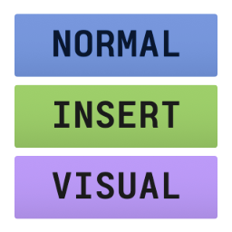

<div align="center">


# Neovim Statusline for VS Code

<a href="https://marketplace.visualstudio.com/items?itemName=why-trv.neovim-statusline"></a>
<a href="https://open-vsx.org/extension/why-trv/neovim-statusline"></a>
</div>

This is a VS Code extension that leverages [Custom UI Style](https://marketplace.visualstudio.com/items?itemName=subframe7536.custom-ui-style)'s CSS and JavaScript injection capabilities to achieve a nicer-looking and more functional statusline for [VSCode Neovim](https://marketplace.visualstudio.com/items?itemName=asvetliakov.vscode-neovim).

Unlike extensions that use `colorCustomizations` to change status, this doesn't pollute your workspace `settings.json`, reacts to mode changes faster, and looks more in line with what you get with statusline plugins in Neovim itself.

For example, it can look like this:
<div align="center">

</div>

instead of this:
<div align="center">

</div>

## Prerequisites

The following extensions need to be installed and configured before proceeding. Please refer to their documentation for details.

- [VSCode Neovim](https://marketplace.visualstudio.com/items?itemName=asvetliakov.vscode-neovim)
- [Custom UI Style](https://marketplace.visualstudio.com/items?itemName=subframe7536.custom-ui-style)

## Configuration

Configure under **Settings → Neovim Statusline** (or `neovim-statusline` in `settings.json`).

| Setting | Type | Default | Description |
|--------|------|---------|-------------|
| `neovim-statusline.autoInject` | boolean | `true` | Automatically add the extension’s CSS/JS paths to Custom UI Style’s `external.imports`. Set to `false` to manage paths yourself (use the **Copy CSS Path** / **Copy JS Path** commands). |
| `neovim-statusline.styles` | object | see below | CSS property values per statusline element and Neovim mode |

**`neovim-statusline.styles`** has three groups: **`line`** (the whole status bar item), **`mode`** (the mode badge, e.g. NORMAL, INSERT), **`msg`** (the text that **VSCode Neovim** adds after the mode, e.g. visual selection size and recent command message). All three use the same shape: an object with keys **`default`** (all modes), **`normal`**, **`command`**, **`insert`**, **`visual`**, **`replace`**. Each value is an object mapping CSS properties (kebab-case) to values. Only defined properties are applied.

You can use **Custom UI Style** variables in your styles, e.g.:
- `var(--cus-mono)` for monospace font family,
- `var(--cus-sans)` for sans-serif font family.

Here's the default configuration snippet for reference:

```json
"neovim-statusline.styles": {
  "line": { "default": { "font-family": "var(--cus-mono)" } },
  "mode": {
    "default": {
      "color": "#1b1b1b",
      "font-weight": "bold",
      "padding-left": "12px",
      "padding-right": "12px",
      "margin-right": "12px"
    },
    "normal": { "background-color": "#a2a2a2" },
    "command": { "background-color": "#e0af68" },
    "insert": { "background-color": "#9ecf6a" },
    "visual": { "background-color": "#bc9af8" },
    "replace": { "background-color": "#f7768e" }
  },
  "msg": {}
}
```

## Available Commands
(Command Palette: **Neovim Statusline**):
- **Reload** — Manually regenerate CSS from settings and reload Custom UI Style (requires VS Code restart).
- **Copy CSS Path** — Copy the generated CSS file path to the clipboard (for manual injection when auto-inject is off).
- **Copy JS Path** — Copy the statusline JS file path to the clipboard (for manual injection when auto-inject is off).
